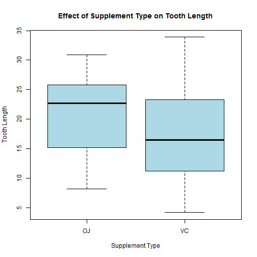
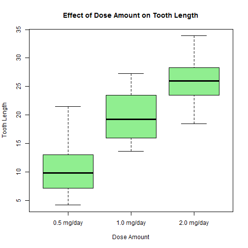
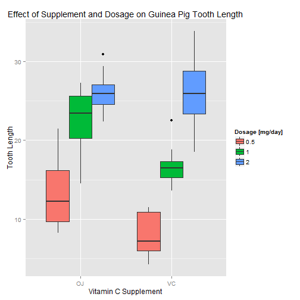

##Exploratory Data Analysis
In this part of the peer assignment, we will explore and perform some basic exploratory analysis of the ToothGrowth dataset. We will also conduct hypothesis tests on the effect of supplement and dosage on tooth growth.

First, let's load and explore the ToothGrowth dataset. We will rename the dataset "pig" for convenience.


```r
data (ToothGrowth)
str (ToothGrowth)
```

```
## 'data.frame':	60 obs. of  3 variables:
##  $ len : num  4.2 11.5 7.3 5.8 6.4 10 11.2 11.2 5.2 7 ...
##  $ supp: Factor w/ 2 levels "OJ","VC": 2 2 2 2 2 2 2 2 2 2 ...
##  $ dose: num  0.5 0.5 0.5 0.5 0.5 0.5 0.5 0.5 0.5 0.5 ...
```

```r
pig <- ToothGrowth
```

The ToothGrowth dataset contains 3 variables and 60 observations per variable. The variables are tooth length, Vitamin C supplement type (OJ or VC), and dosage (mg/day). This dataset contains data from a study performed on 60 guinea pigs, where each was fed a specific amount (0.5, 1, 1.5) [mg/day] of a supplement type daily. The objective of the study was to determine the effect of supplement type and dosage amount on guinea pig tooth growth.

Let's perform some basic exploratory data analyses to gain a basic understanding of our data. First, let's compare the effect of supplement type on tooth length.
    

```r
plot (pig$supp, pig$len, xlab = "Supplement Type", ylab = "Tooth Length", main = "Effect of Supplement Type on Tooth Length", col = "lightblue")
```

 

```r
pig_plot1_OJ <- subset (pig, supp == "OJ"); median (pig_plot1_OJ$len)
```

```
## [1] 22.7
```

```r
pig_plot1_VC <- subset (pig, supp == "VC"); median (pig_plot1_VC$len)
```

```
## [1] 16.5
```

It's clear from the plot that the median tooth length for OJ is higher than VC. The medians are computed to verify this. Next, let's compare the effect of different dosage amounts on tooth length.


```r
dose <- factor (pig$dose, levels = c (0.5, 1.0, 2.0), labels = c ("0.5 mg/day", "1.0 mg/day", "2.0 mg/day"))
plot (dose, pig$len, xlab = "Dose Amount", ylab = "Tooth Length", main = "Effect of Dose Amount on Tooth Length", col = "lightgreen")
```

 

The dosage plot shows that a higher dosage results in longer tooth length.

Finally, let's create a plot showing the effect of different dosages of supplement on guinea pig tooth length.


```r
library (ggplot2)
g <- ggplot (pig, aes (x = supp, y = len, fill = factor (dose)))
g + geom_boxplot () + scale_fill_discrete (name = "Dosage [mg/day]") + labs (x = "Vitamin C Supplement", y = "Tooth Length", title = "Effect of Supplement and Dosage on Guinea Pig Tooth Length")
```

 

Looking at our plot, the median guinea pig tooth length is higher for OJ compared to VC for the 0.5 and 1.0 mg/day dose amounts. For dosage 2.0 mg/day, the medians are exactly the same. With that being said, VC has a bigger impact in terms of range for tooth length for dosage 2.0 mg/day compared to OJ.


##Confidence Intervals & Hypothesis Tests

####1. Assumptions (For All C.I. & Hypothesis Tests Performed)
1. The sample data are IID and normally distributed.
2. When comparing 2 different samples, the variances are not equal.
3. Sixty guinea pigs were tested, and we have 60 observations. Hence, we will be computing independent t-tests with paired = FALSE.
4. Unless stated otherwise, we will be computing 95% confidence intervals.
<br><br>


####2. 95% Confidence Intervals for Average Tooth Length by Supplement
First, let's calculate the 95% C.I. for the mean tooth length for OJ and VC.


```r
pig_OJ <- subset (pig, supp == "OJ")
pig_VC <- subset (pig, supp == "VC")
t.test (pig_OJ$len, alternative = "two.sided")$conf
```

```
## [1] 18.19678 23.12989
## attr(,"conf.level")
## [1] 0.95
```

```r
t.test (pig_VC$len, alternative = "two.sided")$conf
```

```
## [1] 13.87675 20.04992
## attr(,"conf.level")
## [1] 0.95
```

**Conclusion**  
We can say with 95% confidence that the true mean tooth length for the 2 different supplements falls within the computed intervals.
<br><br>


####3. 95% Confidence Intervals for Average Tooth Length by Dosages
Next, let's calculate the 95% C.I. for the mean tooth length for different dosages.


```r
pig_0.5 <- subset (pig, dose == 0.5)
pig_1.0 <- subset (pig, dose == 1.0)
pig_2.0 <- subset (pig, dose == 2.0)
t.test (pig_0.5$len, alternative = "two.sided")$conf
```

```
## [1]  8.499046 12.710954
## attr(,"conf.level")
## [1] 0.95
```

```r
t.test (pig_1.0$len, alternative = "two.sided")$conf
```

```
## [1] 17.66851 21.80149
## attr(,"conf.level")
## [1] 0.95
```

```r
t.test (pig_2.0$len, alternative = "two.sided")$conf
```

```
## [1] 24.33364 27.86636
## attr(,"conf.level")
## [1] 0.95
```

**Conclusion**    
We can say with 95% confidence that the true mean tooth length for the 3 different dosages falls within the computed intervals.
<br><br>


####4. 95% Confidence Intervals for Difference in Tooth Length Means by Supplement
Now, let's compare the mean tooth growth by supplement. The null hypothesis states there is no difference in the means.    
X1 = Mean OJ, X2 = Mean VC    
Ho: X1 - X2 = 0  
Ha: X1 - X2 !=0


```r
t.test (pig_OJ$len, pig_VC$len, alternative = "two.sided", mu = 0, paired = FALSE, var.equal = FALSE)
```

```
## 
## 	Welch Two Sample t-test
## 
## data:  pig_OJ$len and pig_VC$len
## t = 1.9153, df = 55.309, p-value = 0.06063
## alternative hypothesis: true difference in means is not equal to 0
## 95 percent confidence interval:
##  -0.1710156  7.5710156
## sample estimates:
## mean of x mean of y 
##  20.66333  16.96333
```

```r
qt (.975, 55.309)
```

```
## [1] 2.003793
```

**Conclusion**  
We fail to reject the null hypothesis in favor of the alternative for the following reasons:  
1. The test statistic (1.915) is less than the t-quantile (2.004) and does not fall in the critical region.  
2. The p-value (0.0606) is greater than the signifiance or alpha level of 0.05.  
3. We can say with 95% confidence that zero (no difference in means) lies within the interval of the difference in means.
<br><br>


####5. 95% Confidence Intervals for Difference in Tooth Length Means by Dosages  
**Part 5-1 - Compare Difference in Means for Dose = 0.5 for OJ vs. VC**  
Ho: X1 - X2 = 0    
Ha: X1 - X2 !=0


```r
pig_OJ_0.5 <- subset (pig, dose == 0.5 & supp == "OJ")
pig_VC_0.5 <- subset (pig, dose == 0.5 & supp == "VC")

t.test (pig_OJ_0.5$len, pig_VC_0.5$len, alternative = "two.sided", mu = 0, paired = FALSE, var.equal = FALSE)
```

```
## 
## 	Welch Two Sample t-test
## 
## data:  pig_OJ_0.5$len and pig_VC_0.5$len
## t = 3.1697, df = 14.969, p-value = 0.006359
## alternative hypothesis: true difference in means is not equal to 0
## 95 percent confidence interval:
##  1.719057 8.780943
## sample estimates:
## mean of x mean of y 
##     13.23      7.98
```

```r
qt (.975, 55.309)
```

```
## [1] 2.003793
```

**Part 5-1 Conclusion**  
We choose to reject the null hypothesis in favor of the alternative for the following reasons:  
1. The test statistic (3.170) is greater than the t-quantile (2.004) and falls in the critical region.  
2. The p-value (0.00634) is less than the signifiance or alpha level of 0.05.  
3. We can say with 95% confidence that zero (no difference in means) does not lie within the computed interval of the difference in means
<br><br>


**Part 5-2 - Compare Difference in Means for Dose = 1.0 for OJ vs. VC**  
Ho: X1 - X2 = 0    
Ha: X1 - X2 !=0


```r
pig_OJ_1.0 <- subset (pig, dose == 1.0 & supp == "OJ")
pig_VC_1.0 <- subset (pig, dose == 1.0 & supp == "VC")

t.test (pig_OJ_1.0$len, pig_VC_1.0$len, alternative = "two.sided", mu = 0, paired = FALSE, var.equal = FALSE)
```

```
## 
## 	Welch Two Sample t-test
## 
## data:  pig_OJ_1.0$len and pig_VC_1.0$len
## t = 4.0328, df = 15.358, p-value = 0.001038
## alternative hypothesis: true difference in means is not equal to 0
## 95 percent confidence interval:
##  2.802148 9.057852
## sample estimates:
## mean of x mean of y 
##     22.70     16.77
```

```r
qt (.975, 55.309)
```

```
## [1] 2.003793
```

**Part 5-2 Conclusion**  
We choose to reject the null hypothesis in favor of the alternative for the following reasons:  
1. The test statistic (4.033) is greater than the t-quantile (2.004) and falls in the critical region.  
2. The p-value (0.0010) is less than the signifiance or alpha level of 0.05.  
3. We can say with 95% confidence that zero (no difference in means) does not lie within the computed interval of the difference in means
<br><br>


**Part 5-3 - Compare Difference in Means for Dose = 2.0 for OJ vs. VC**  
Ho: X1 - X2 = 0  
Ha: X1 - X2 !=0


```r
pig_OJ_2.0 <- subset (pig, dose == 2.0 & supp == "OJ")
pig_VC_2.0 <- subset (pig, dose == 2.0 & supp == "VC")

t.test (pig_OJ_2.0$len, pig_VC_2.0$len, alternative = "two.sided", mu = 0, paired = FALSE, var.equal = FALSE)
```

```
## 
## 	Welch Two Sample t-test
## 
## data:  pig_OJ_2.0$len and pig_VC_2.0$len
## t = -0.046136, df = 14.04, p-value = 0.9639
## alternative hypothesis: true difference in means is not equal to 0
## 95 percent confidence interval:
##  -3.79807  3.63807
## sample estimates:
## mean of x mean of y 
##     26.06     26.14
```

```r
qt (.975, 55.309)
```

```
## [1] 2.003793
```

**Part 5-3 Conclusion**  
We choose **not** to reject the null hypothesis in favor of the alternative for the following reasons:  
1. The test statistic (-0.046) is between the t-quantile interval [-2.004, 2.004] and does not fall within the critical region.  
2. The p-value (0.964) is greater than the signifiance or alpha level of 0.05.  
3. We can say with 95% confidence that zero (no difference in means) lies within the computed interval of the difference in means.  
<br><br>
